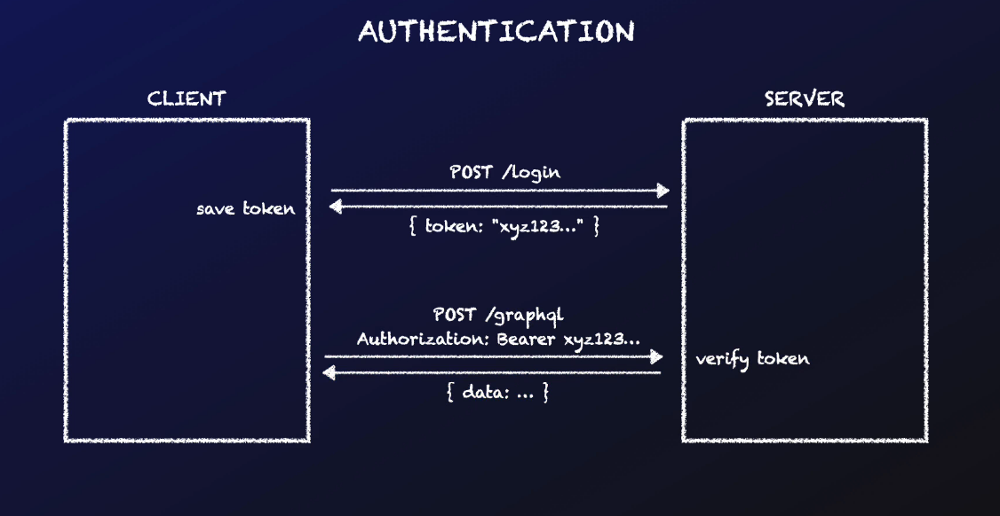

# Authentication

## Authentication Flow

- In this section we'll talk about authentication and authorisation. We know that, in our Job Board application, users can post a new job. But they should only be able to do that if they are logged in. If you're not logged in you don't even see the Post Job link in the page. But that's not sufficient from a security point of view.
- Because somebody could send a createJob request directly to our GraphQL server. Like we did many times ourselves using the Apollo Sandbox. A malicious user could easily call our server and post a "Spam Job". Let's write here that this was "Posted by an intruder".
- And if we execute this mutation, the job will be created, even though we're not logged in into our frontend application.
- This means bad people on the internet could fill our job board with spam posts like this one. Before we jump into writing the code to protect our createJob mutation, let me give you an overview of how authentication works. We have a server application, of course, that talks to the database and exposes a GraphQL API.
- Then we have a separate client app, that is our web frontend. When the user logs in, the client makes an HTTP request to the "/login" path on the server.
- And the server responds with an authentication token, that is a special string that securely identifies the user. Note that this is not a GraphQL request, because it's better to keep the authentication step outside of the GraphQL API.
- So the client receives this "token", and saves it somewhere, like in local storage or in cookies. For the Job Board example we use local storage just because it's simpler, but cookies can be slightly more secure.
- The client saves the token so that, every time it makes any API request, like GraphQL requests in our example, it will include the token in the request, typically in a HTTP header called "Authorization".
- The token identifies the user, and is signed by the server. So when the server receives a request from the client, it can verify that it was sent by a legitimate user.
- Assuming the token is valid, the server will return whatever data the client asked for. This is a pretty standard authentication flow.



- Credentials to login
  -->

```
[
  {
    "id": "uogQAZnLcAlT6lMuNbpQg",
    "email": "alice@facegle.io",
    "password": "alice123",
    "companyId": "pVbRRBQtMVw6lUAkj1k43"
  },
  {
    "id": "i0Nn6qvicHP5DTuKTyaq0",
    "email": "bob@goobook.co",
    "password": "bob123",
    "companyId": "wvdB54Gqbdp_NZTXK9Tue"
  }
]
```
