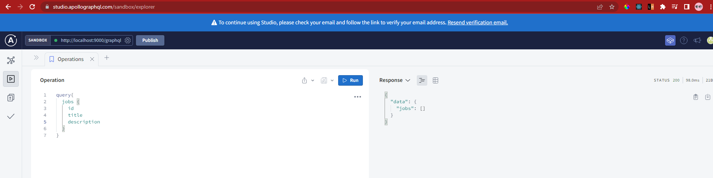
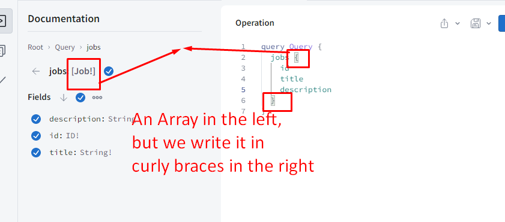
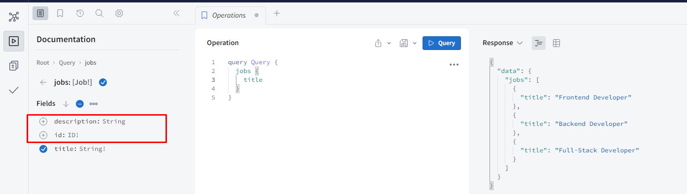

# Install the dependencies

- W.r.t package.json install the dependencies
- install npm package with `npm install `

1. SERVER

- In server/server.js it contains most of the server code
- we can start the server with `npm start`
- The server uses 'nodemon' , it will automatically start the server whenever we change our code
- When we start the server using `npm start` it will run on the different port of local host, click on that url and open the graphql server in the chrome.

2. CLIENT

- In package.json , it uses below dependencies

```
 "dependencies": {
    "@apollo/client": "^3.6.0",
    "bulma": "^0.9.3",
    "graphql": "^16.4.0",
    "react": "^18.1.0",
    "react-dom": "^18.1.0",
    "react-router": "^6.3.0",
    "react-router-dom": "^6.3.0"
  }
```

- bulma, is a dependency for css
- react is a js framework
- Installing npm package using `npm install`
- Starting react project using `npm start`

# Hardcoded data in client side

# APOLLO SERVER FOR EXPRESS

- Fetching real data from the server side
- We will start using apollo server with express in this project
- [https://www.apollographql.com/docs/](https://www.apollographql.com/docs/)
- [https://www.apollographql.com/docs/apollo-server/getting-started](https://www.apollographql.com/docs/apollo-server/getting-started)

- Go to the server folder and install the dependencies with

` npm install apollo-server-express`

`npm install graphql`

- Then import to server.js as `import { ApolloServer } from "apollo-server-express";`
- So here in "server.js" we now need to load our "schema.graphql" file. And to do that I'm going to import the "readFile" function provided by the "fs/promises" module. "fs" stands for "File System", and is one of the built-in modules that come with Node.js.
- We can call "readFile" passing the file name, that is "schema.graphql".
- "./" in front to make it clear that the path is relative to the project directory. Then we need to pass a second argument that is the character encoding, and should be "utf8".
- Now, this "readFile" function will return a "Promise" with the data, so we'll need to "await" its result. Note that we can use "await" even in top-level code, with recent Node.js versions.
- created the "typeDefs". Now we also need some "resolvers". Just like for the schema, in this project to create a separate file for our resolvers.
- This is a regular JavaScript file, where we can export a "resolvers" object, that's what we'll pass to ApolloServer.
- Here we need a nested "Query" object, and, to match our initial schema, let's write a "greeting" function, that simply returns a hard-coded string.
- This is just like our first example. Now that we have our "resolvers" we can go and import them into our "server.js" file. So import the "resolvers" object from the "resolvers" module, and we need to add ".js", because that's required by Node.js when importing local modules. At this point we can pass this "resolvers" object to ApolloServer.
- The next step is to start ApolloServer, and we can do that by calling its "start" method. But we need to be careful here, because "start" is asynchronous. You can see that it returns a Promise. So we need to "await" the "start" operation.
- At this point we need to plug ApolloServer into our Express application. The way to do this is to call "apolloServer.applyMiddleware". This method takes an object where we can pass our Express "app". So this will expose the GraphQL server as part of the Express server.
- Optionally we can also set a "path" here, specifying where we want to receive GraphQL requests. This defaults to "/graphql", but I like to set it explicitly, so it's easier to find out if you look at the code. This way any HTTP request sent to "/graphql" will be routed by the Express framework to the ApolloServer middleware. While any other request will be handled by Express as usual. For example a POST request for the "/login" path will be routed to the login handler defined on line 20.
- **So by using Apollo Server with Express we can handle both GraphQL requests, and other HTTP requests in the same server.** Now, let's start the server by running "npm start", that will launch our "server.js" script using Nodemon, and we can see that the server is running on port 9000.
- This way we can easily click on this URL to open the Apollo Server welcome page, from where we can open the Sandbox. And if run this query we can see that the GraphQL server is working fine! So this is how we can integrate Apollo Server into an Express application. It's similar to running Apollo Server on its own, but there's an extra step required to plug the GraphQL handler as an Express middleware.

---

# CUSTOM TYPE DEFINITION

- each job object contains

```
job object={
              job-id:
              job-title:
              description:
              company:
            }
```

- go back to schema.graphql under server folder and write the type definition to write exactly the data.
- (custom scalar types in graphQL)[https://graphql.org/learn/schema/#scalar-types]
- ```
  type Job {
      id: ID!
    }

  ```

- '!' exclamation mark indicates that it is mandatory, it cannot be null, here each job must have an id.
- ```
  type Query {
      jobs: [Job!]
    }

  ```

- 'Job! 'each element in an array cannot be a null element inside an array.
- Each element in an array of jobs, should be a Job object

- Schema Definition under 'server' >schema.graphql

```
type Query {
  jobs: [Job!]
}

type Job {
  id: ID!
  title: String!
  description: String
}

```

- server> resolver.js

```
export const resolvers = {
  Query: {
    jobs: () => [],
  },
};
```

- Start the server using `npm start` , the graphql server will be started
- here the resolver function simply returns an empty array



# DATABASE RESOLVER

- the data we get from resolver function must match the schema definition
- server>resolver.js

```
export const resolvers = {
  Query: {
    jobs: () => [
      {
        id: "id1",
        title: "Title 1",
        description: "Description 1",
      },
      {
        id: "id2",
        title: "Title 2",
        description: "Description 2",
      },
      {
        id: "id3",
        title: "Title 3",
        description: "Description 3",
      },
      {
        id: "id4",
        title: "Title 4",
        description: "Description 4",
      },
    ],
  },
};

```

- server>schema.graphql

```
type Query {
  jobs: [Job!]
}

type Job {
  id: ID!
  title: String!
  description: String
}
```


- Note :

1. In javascript the missing property would be 'undefined'
2. In graphql the missing property will be 'null'

-

```
export const resolvers = {
  Query: {
    jobs: () => [
      {
        id: "id1",
        title: "Title 1",

      },
      {
        id: "id2",
        title: "Title 2",
        description: "Description 2",
      },
      {
        id: "id3",
        title: "Title 3",
        description: "Description 3",
      },
      {
        id: "id4",
        title: "Title 4",
        description: "Description 4",
      },
    ],
  },
};
```


- A resolver function can also be asynchronous, in other words it can return a 'promise'. This is useful whenever the data needs to be fetched fom a database or by calling some other API.

- Proving that 'query still works even if resolver is asynchronous'

- server>resolver.js

```
export const resolvers = {
  Query: {
    jobs: async () => [
      {
        id: "id1",
        title: "Title 1",
        description: "Description 1",
      },
      {
        id: "id2",
        title: "Title 2",
        description: "Description 2",
      },
      {
        id: "id3",
        title: "Title 3",
        description: "Description 3",
      },
      {
        id: "id4",
        title: "Title 4",
        description: "Description 4",
      },
    ],
  },
};
```


- Now removing all the hard-coded data and using some data from 'server/db.js'
- server/db.js contains data from `server/data/companies.json` , `server/data/jobs.json`, `server/data/users.json`.

- Installing npm package 'fakebase' (https://www.npmjs.com/package/fakebase)[https://www.npmjs.com/package/fakebase]
- A "fake" database for Node.js that stores data in local JSON files, for testing and sample applications.
- `npm install fakebase`
- Usage:

[Image](./Imgs//5.png)

- All operations like `.create()` , `.findAll()`, `.findById()`, `.update()`, `.delete()`, `.findOne()`, are asynchronous.
- Since they are asynchronous, they returns back the promise.

- server/resolver.js

```
import { Job } from "./db.js";

export const resolvers = {
  Query: {
    jobs: () => Job.findAll(),
  },
};
```

- In db.js we have './data'
- In data we have jobs.json

- server/data/jobs.json
- jobs.json

```
[
  {
    "id": "soP9m8MdKeQX_ZXZOCSaL",
    "companyId": "pVbRRBQtMVw6lUAkj1k43",
    "title": "Frontend Developer",
    "description": "We are looking for a Frontend Developer familiar with React."
  },
  {
    "id": "GR7vTA_btqTnLtXcEDX8C",
    "companyId": "pVbRRBQtMVw6lUAkj1k43",
    "title": "Backend Developer",
    "description": "We are looking for a Backend Developer familiar with Node.js and Express."
  },
  {
    "id": "yX71WsWqBRAFuMAIDj4W0",
    "companyId": "wvdB54Gqbdp_NZTXK9Tue",
    "title": "Full-Stack Developer",
    "description": "We are looking for a Full-Stack Developer familiar with Node.js, Express, and React."
  }
]
```

- Therefore when you run the graphql query we get as below:
  
- So we got an array of three objects.
- Notice that if we see the schema type definition, we have no property like 'companyId' in graphql response data, so the graphQl simply ignores that.It's okay to erite extra properties in local .json files
- Now resolver function for the jobs query returns the data from our database.

# Field Selection

- More about the query language:
- we have a job type that contains a multiple fields



- One of the main features of GraphQL is that we can decide which fields we want from the server, for example if we are not interested in 'description' we can remove it.


- GraphQl helps us to prevent fetching more data than we need, it prevents overfetching.
  -The client is always free to decide what they want, they can ask only for title, even if the id is not asked, it will display only title



# Job Company Association

- Each job is associated with a company
- server/schema.graphql
-

```
type Query {
  jobs: [Job!]
}

type Company {
  id: ID!
  name: String!
}
type Job {
  id: ID!
  title: String!
  company: Company
  description: String
}
```


- company value will be null, because we have not written anything in resolver function.
- so declaring company field as mandatory ones, `Company!`
- matching type defintion of schema w.r.t resolver and .json files

## 

## 

## 

Output:

## 

- We need to find the specific company for the respective job, and not same company for all jobs

- We have companyId, in jobs.json --> we need to get the company id in the resolver function as shown below

```
import { Job } from "./db.js";

export const resolvers = {
  Query: {
    jobs: () => Job.findAll(),
  },
  Job: {
    company: (job) => {
      console.log("Resolving company for job:", job);
      return {
        id: "fake",
        name: "Fake Inc.",
      };
    },
  },
};
```

- 

---

- 

---

- 

- 'comapanyId' is a foreign key, and there is a "many-to-one" relationship between the "Job" Table and "Company" Table
- Importing Company table in resolver.js and removing the hardcoded data.

```
import { Job } from "./db.js";
import { Company } from "./db.js";
export const resolvers = {
  Query: {
    jobs: () => Job.findAll(),
  },
  Job: {
    company: (job) => {
      return Company.findById(job.companyId);
    },
  },
};

```

Response :


- Simplyfying as below:


- Notice that,
  -Make sure to pay attention to the relationship between the schema and our resolvers.
- We can write a resolver function for any field we want, and if we do provide a resolver function then that's what the GraphQL framework will call to get the value for that field.
- In this case for every Job object it will call our "company" resolver.
- While for all the other fields for which we don't provide a resolver function, like "id", "title", and "description", the GraphQL framework will simply use the values we provided in the previous step of the resolution chain, in this case the values returned by the "jobs" resolver for the Query type.
- So basically we need to write a resolver function for a field in a custom type like Job only if we need some special logic to find the right value for that field, like in this case where we need to load the Company object from the database based on the "job.companyId".

---

## Better understanding with console.log and terminal outputs:

- server/resolver.js

```
import { Job } from "./db.js";
import { Company } from "./db.js";
export const resolvers = {
  Query: {
    jobs: () => {
      console.log(
        "JOB FROM TABLE IS ",
        Job.findAll().then((res) =>
          console.log("RESULT IS ANY ARRAY OF OBJECTS: ", res)
        )
      );
      return Job.findAll();
    },
  },

  Job: {
    company: (job) => {
      console.log("JOB IS:", job);

      console.log(
        "COMPANY IS",
        Company.findById(job.companyId).then((res) =>
          console.log("COMPANY RESULT WITH FIND BY ID  IS :", res)
        )
      );
      return Company.findById(job.companyId);
    },
  },
};

```

- Terminal Output:

```
Server running on port 9000
GraphQL endpoint: http://localhost:9000/graphql
JOB FROM TABLE IS  Promise { <pending> }

RESULT IS ANY ARRAY OF OBJECTS:  [
  {
    id: 'soP9m8MdKeQX_ZXZOCSaL',
    companyId: 'pVbRRBQtMVw6lUAkj1k43',
    title: 'Frontend Developer',
    description: 'We are looking for a Frontend Developer familiar with React.'
  },
  {
    id: 'GR7vTA_btqTnLtXcEDX8C',
    companyId: 'pVbRRBQtMVw6lUAkj1k43',
    title: 'Backend Developer',
    description: 'We are looking for a Backend Developer familiar with Node.js and Express.'
  },
  {
    id: 'yX71WsWqBRAFuMAIDj4W0',
    companyId: 'wvdB54Gqbdp_NZTXK9Tue',
    title: 'Full-Stack Developer',
    description: 'We are looking for a Full-Stack Developer familiar with Node.js, Express, and React.'
  }
]

JOB IS: {
  id: 'soP9m8MdKeQX_ZXZOCSaL',
  companyId: 'pVbRRBQtMVw6lUAkj1k43',
  title: 'Frontend Developer',
  description: 'We are looking for a Frontend Developer familiar with React.'
}
COMPANY IS Promise { <pending> }

JOB IS: {
  id: 'GR7vTA_btqTnLtXcEDX8C',
  companyId: 'pVbRRBQtMVw6lUAkj1k43',
  title: 'Backend Developer',
  description: 'We are looking for a Backend Developer familiar with Node.js and Express.'
}
COMPANY IS Promise { <pending> }

JOB IS: {
  id: 'yX71WsWqBRAFuMAIDj4W0',
  companyId: 'wvdB54Gqbdp_NZTXK9Tue',
  title: 'Full-Stack Developer',
  description: 'We are looking for a Full-Stack Developer familiar with Node.js, Express, and React.'
}
COMPANY IS Promise { <pending> }

COMPANY RESULT WITH FIND BY ID  IS : {
  id: 'pVbRRBQtMVw6lUAkj1k43',
  name: 'Facegle',
  description: 'We are a startup on a mission to disrupt social search engines. Think Facebook meet Google.'
}
COMPANY RESULT WITH FIND BY ID  IS : {
  id: 'pVbRRBQtMVw6lUAkj1k43',
  name: 'Facegle',
  description: 'We are a startup on a mission to disrupt social search engines. Think Facebook meet Google.'
}
COMPANY RESULT WITH FIND BY ID  IS : {
  id: 'wvdB54Gqbdp_NZTXK9Tue',
  name: 'Goobook',
  description: 'We are a startup on a mission to disrupt search social media. Think Google meet Facebook.'
}

```


---


