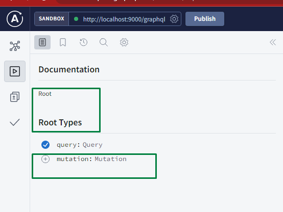
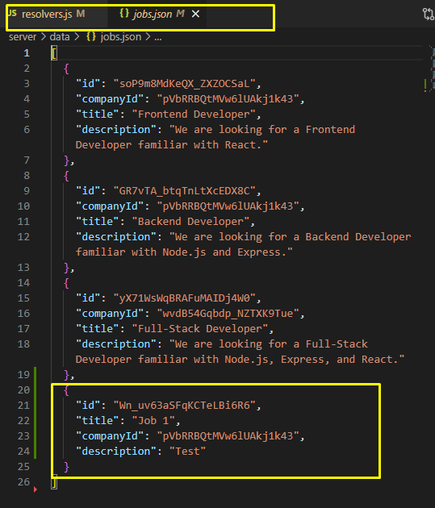
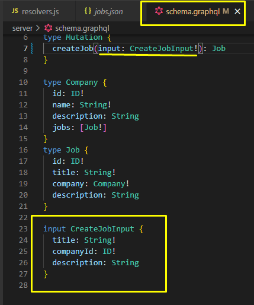
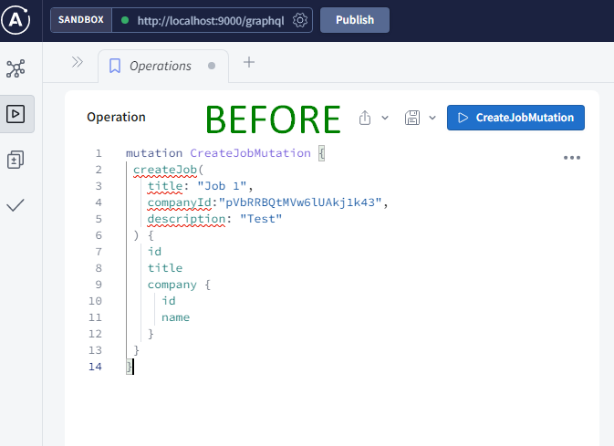

# Mutations

- Queries are read only operations, i.e we get some data from the server. we never modify that data.
- Use verbs in writing mutation names, and nouns for query names.
- All mutations must return a result.
- Better to return full object.

## Mutation Definition

- Operations that modify data
- Post a job once you log in to the job-board application
- Once you logged in, you will get an option called 'Post a job' along with home and login.
- On submit of 'post a new job ' data, we want to call the graphQL server, and save the new job to the database.

1. Server side functionality:

- server/ schema.graphql

- server/resolver.js

  --> resolver function will always accept two parameters , root and the arguments.
  --> arguments can be destructured
  as {title,companyId, description} in t his example
  --> 

- Invoking a mutation using Apollo Sandbox
  --> 
  --> 
  --> 
  --> 
  --> Notice that jobid was generated automatically by the server.
  --> If we see the SERVER/DATA/jobs.json, the new job is saved there
  --> 
  --> 

## Input types

- in graphql schema , we define input types
  --> 
- Changing in resolver.js in server code
  --> 
  --> Keeping everything in single line
  
- Testing in the apollo sandbox:
  
  
  --> New job data seen in .json file as shown below
  
  

- If we want to delete the data, first stop the server, then delete the objects in jobs.json file
